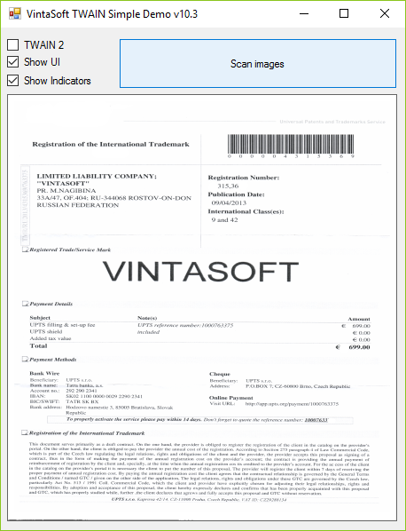

# VintaSoft WinForms TWAIN Simple Demo

This WinForms project uses <a href="https://www.vintasoft.com/vstwain-dotnet-index.html">VintaSoft TWAIN .NET SDK</a> and demonstrates how to acquire images from TWAIN device in WinForms using a few strings of code.


## Screenshot



## Usage
1. Get the 30 day free evaluation license for <a href="https://www.vintasoft.com/vstwain-dotnet-index.html" target="_blank">VintaSoft TWAIN .NET SDK</a> as described here: <a href="https://www.vintasoft.com/docs/vstwain-dotnet/Licensing-Twain-Evaluation.html" target="_blank">https://www.vintasoft.com/docs/vstwain-dotnet/Licensing-Twain-Evaluation.html</a>

2. Update the evaluation license in "CSharp\MainForm.cs" file:
   ```
   Vintasoft.Twain.TwainGlobalSettings.Register("REG_USER", "REG_EMAIL", "EXPIRATION_DATE", "REG_CODE");
   ```

3. Build the project ("TwainSimpleDemo.Net10.csproj" file) in Visual Studio or using .NET CLI:
   ```
   dotnet build TwainSimpleDemo.Net10.csproj
   ```

4. Run compiled application.


## Documentation
VintaSoft TWAIN .NET SDK on-line User Guide and API Reference for .NET developer is available here: https://www.vintasoft.com/docs/vstwain-dotnet/


## Support
Please visit our <a href="https://myaccount.vintasoft.com/">online support center</a> if you have any question or problem.
